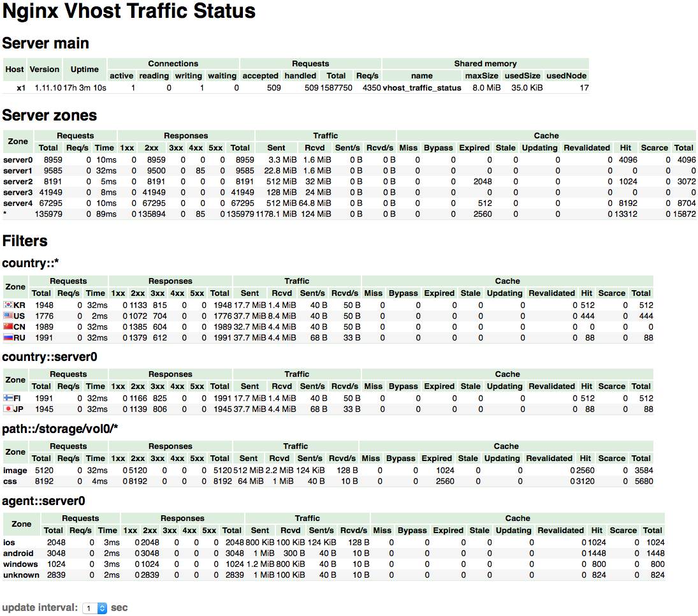

# Custom Nginx with VTS Module 🚀

Create a customized Nginx with the VTS (Virtual Host Traffic Status) module effortlessly using this Dockerfile and build script. <br>
you can find the actuall module [here](https://github.com/vozlt/nginx-module-vts). All credits to him, Check it out for more info.<br> we're just simplifying the build process. 
<br>
you can check the nginx-sample folder to get started with nginx.

## Features

- 🛠️ Automated build process
- 📦 Easily install dependencies
- 🤖 Build Nginx with VTS module
- 🔄 Using the latest Nginx version (1.24)

<br>
</br>
</br>


## Quick Start


1. Clone this repository:

   ```bash
   git clone https://github.com/SmartechOpenSource/nginx-vts
   cd nginx-vts
   ```
2. build locally with builder.sh or a docker image with Dockerfile
   ```
   ./builder.sh
   docker build -t company/nginx-vts:1.24 .
   ```
   
